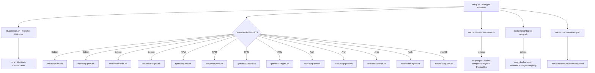
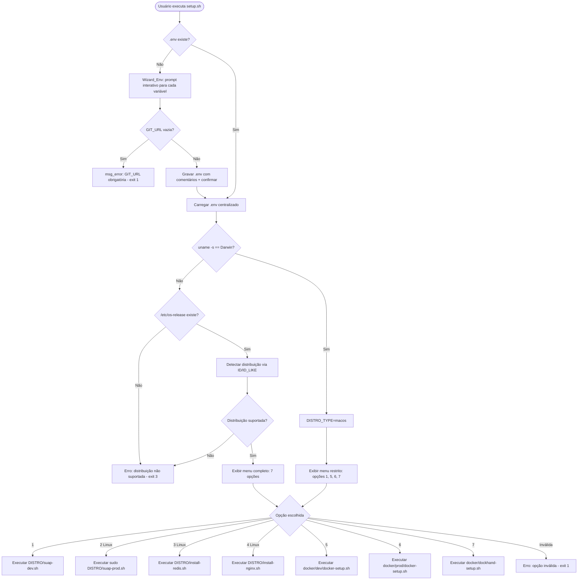
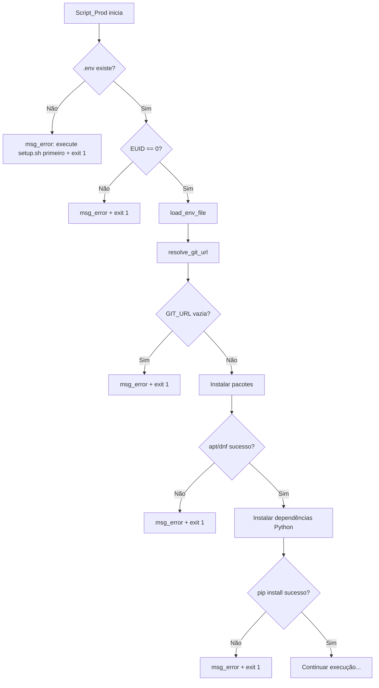

# Design Document

## Overview

Este documento descreve o design técnico do projeto **suap-setup**, uma coleção de scripts shell que automatizam a configuração do ambiente da aplicação SUAP em sistemas Linux e macOS. O sistema é composto por um wrapper principal (`setup.sh`) que detecta a distribuição ou sistema operacional, exibe um menu interativo (com restrições por plataforma) e delega a execução para scripts especializados por família de distribuição (Debian/RPM/Arch) ou sistema operacional (macOS) e por tipo de ambiente (dev/prod/Docker).

### Decisões de Design

1. **Arquivo `.env` centralizado**: Todas as variáveis compartilhadas são lidas de um único arquivo na raiz do repositório, eliminando duplicação entre scripts.
2. **Funções utilitárias em `lib/common.sh`**: Lógica compartilhada (carregamento de .env, detecção de distro, output colorido, verificações idempotentes, wizard interativo) é extraída para um arquivo de biblioteca sourced por todos os scripts.
3. **Separação por família de distribuição/OS**: Scripts em `deb/`, `rpm/`, `arch/` e `macos/` contêm apenas lógica específica do gerenciador de pacotes ou plataforma.
4. **Docker por delegação (sem Dockerfiles locais)**: Ambientes Docker delegam integralmente para os projetos upstream — `docker/dev/` delega para o `docker-compose.dev.yml` do SUAP_Repo (suap) e `docker/prod/` delega para o Makefile do Deploy_Repo (suap_deploy). O suap-setup não mantém Dockerfiles nem docker-compose próprios.
5. **Idempotência por verificação prévia**: Cada etapa verifica o estado antes de agir, usando cores diferentes para ações executadas vs. puladas.
6. **Wizard interativo para .env**: Na primeira execução do wrapper, um assistente interativo (`interactive_env_wizard`) guia o usuário pela criação do .env com prompts descritivos, defaults e validação de campos obrigatórios — substituindo a criação silenciosa com valores padrão.
7. **Fallback de .env em scripts individuais**: Scripts executados diretamente (sem wrapper) abortam com erro se .env não existe, evitando execução parcial sem configuração.
8. **Halt imediato em falhas críticas**: Falhas em instalação de pacotes (apt/dnf) e dependências Python (uv/pip) resultam em exit 1 imediato, evitando ambientes em estado inconsistente.

## Architecture

### Diagrama de Componentes



### Fluxo de Execução Principal



## Components and Interfaces

### 1. Biblioteca Compartilhada (`lib/common.sh`)

Módulo central com funções utilitárias reutilizáveis por todos os scripts.

```bash
#!/usr/bin/env bash
# lib/common.sh - Funções utilitárias compartilhadas

# --- Carregamento de variáveis ---

# load_env_file(env_path)
# Carrega variáveis do arquivo .env centralizado.
# Parâmetros: caminho absoluto do .env
# Retorno: exporta variáveis como variáveis de shell
# Comportamento:
#   - Quando chamada pelo wrapper (setup.sh): se .env não existe, invoca interactive_env_wizard()
#   - Quando chamada por scripts individuais (suap-dev.sh, suap-prod.sh, docker-setup.sh):
#     se .env não existe, exibe msg_error e exit 1 (fallback — scripts individuais não
#     executam o wizard, exigem que o wrapper tenha sido executado antes)
# Exit 1 se o arquivo não existir (modo individual) ou se variáveis obrigatórias faltarem
load_env_file() { ... }

# require_env_file(env_path)
# Verifica se o .env existe; caso contrário, exibe erro e aborta.
# Usado pelos scripts individuais que NÃO devem iniciar o wizard.
# Exit 1 se o arquivo não existir
require_env_file() { ... }

# interactive_env_wizard(env_path)
# Assistente interativo para criação do .env na primeira execução pelo wrapper.
# Solicita ao usuário: PYTHON_VERSION, BASE_DIR, SUAP_DIR, VENV_DIR, GIT_URL.
# Para cada variável:
#   - Exibe nome, descrição do propósito, exemplos e valor padrão (dev)
#   - Se o usuário pressiona Enter sem digitar → usa valor padrão
# Exceção: GIT_URL não possui valor padrão → exit 1 se vazia
# Após coleta, grava o .env com comentários descritivos e exibe confirmação.
# Parâmetros: caminho absoluto onde criar o .env
# Exit 1 se GIT_URL vazia
interactive_env_wizard() { ... }

# ensure_env_for_option(env_path, option)
# Coleta apenas as variáveis necessárias para a opção escolhida pelo usuário.
# Fluxo:
#   1. Carrega .env existente (se houver)
#   2. Verifica quais variáveis estão faltando para a opção escolhida
#   3. Solicita apenas as variáveis ausentes via prompt interativo
#   4. Grava o .env atualizado com comentários descritivos
#   5. Exibe confirmação com os valores configurados
# Variáveis por opção:
#   Opção 1-2: PYTHON_VERSION, BASE_DIR, SUAP_DIR, VENV_DIR, GIT_URL
#   Opção 3-4: Nenhuma
#   Opção 5: SUAP_DIR, GIT_URL, SUAP_IMAGE
#   Opção 6: DEPLOY_DIR, DEPLOY_GIT_URL
#   Opção 7: Nenhuma
# Parâmetros: caminho do .env, número da opção
ensure_env_for_option() { ... }

# resolve_git_url(env_path)
# Lê GIT_URL do .env ou solicita ao usuário via prompt interativo.
# Persiste o valor informado no .env para uso futuro.
# Parâmetros: caminho do .env
# Retorno: exporta GIT_URL
# Exit 1 se URL informada estiver vazia
resolve_git_url() { ... }

# --- Detecção de Distribuição ---

# detect_distro()
# Primeiro verifica uname -s: se "Darwin" → classifica como "macos".
# Caso contrário, lê /etc/os-release e classifica em "deb", "rpm" ou "arch".
# Retorno: define DISTRO_TYPE ("deb"|"rpm"|"arch"|"macos") e DISTRO_NAME
# Exit 3 se:
#   - não é macOS E /etc/os-release não existe
#   - distro não suportada (não é Debian, RPM nem Arch)
detect_distro() { ... }

# get_supervisor_conf_dir()
# Retorna o diretório de configuração do Supervisor baseado na distro.
# Retorno: "/etc/supervisor/conf.d" (Debian) | "/etc/supervisord.d" (RPM) | "/etc/supervisor.d" (Arch)
# Nota: Não aplicável para macOS (macOS não suporta produção)
get_supervisor_conf_dir() { ... }

# get_nginx_conf_path()
# Retorna o caminho de destino da configuração do Nginx.
# Retorno: varia por distro (sites-available vs conf.d)
# Nota: Não aplicável para macOS
get_nginx_conf_path() { ... }

# --- Output Colorido ---

# Constantes de cor
GREEN=$(tput setaf 2)
YELLOW=$(tput setaf 3)
RED=$(tput setaf 1)
NO_COLOR=$(tput sgr0)

# msg_action(mensagem)
# Exibe mensagem em verde (ação sendo executada)
msg_action() { echo "${GREEN}>>> $1 ${NO_COLOR}"; }

# msg_skip(mensagem)
# Exibe mensagem em amarelo (etapa já concluída)
msg_skip() { echo "${YELLOW}>>> $1 ${NO_COLOR}"; }

# msg_error(mensagem)
# Exibe mensagem em vermelho (erro)
msg_error() { echo "${RED}ERRO: $1 ${NO_COLOR}"; }

# --- Verificações Idempotentes ---

# is_pkg_installed(pkg_name)
# Verifica se um pacote está instalado.
# Usa dpkg (Debian), rpm (RPM), pacman -Q (Arch) ou brew list --formula | grep -q (macOS) conforme DISTRO_TYPE.
# Retorno: 0 se instalado, 1 caso contrário
is_pkg_installed() { ... }

# check_all_packages_installed(pkg_list)
# Verifica se todos os pacotes da lista estão instalados.
# Retorno: 0 se todos instalados, 1 se algum faltando
check_all_packages_installed() { ... }

# --- Verificação de Pré-requisitos Docker ---

# check_docker_available()
# Verifica se Docker e Docker Compose estão instalados.
# Em macOS: verifica se Docker Desktop está instalado (docker CLI via /usr/local/bin/docker ou /opt/homebrew/bin/docker).
# Em Linux: verifica binários docker e docker compose no PATH.
# Se não disponível, oferece instalar automaticamente via Script_Install_Docker:
#   - Debian: adiciona repositório oficial + instala via apt
#   - RPM: adiciona repositório oficial + instala via dnf
#   - Arch: instala via pacman -S --needed --noconfirm docker docker-compose
#   - macOS: exibe URL do Docker Desktop, sem instalação automática
# Exit 1 com mensagem de erro se não disponíveis e usuário recusa instalar
check_docker_available() { ... }
```

### 2. Wrapper Principal (`setup.sh`)

```bash
#!/usr/bin/env bash
set -u
# setup.sh - Ponto de entrada principal

# Algoritmo:
# 1. Determinar SCRIPT_DIR (diretório raiz do repositório)
# 2. Source lib/common.sh
# 3. Verificar se .env existe:
#    - Se não: executar interactive_env_wizard() (Requirement 28)
#    - Se sim: carregar com load_env_file()
# 4. Detectar distribuição/OS (detect_distro):
#    a. Verificar uname -s == "Darwin" → DISTRO_TYPE="macos"
#    b. Caso contrário, ler /etc/os-release → "deb", "rpm" ou "arch"
# 5. Exibir menu:
#    - macOS: menu restrito (opções 1, 5, 6, 7 — ocultar 2, 3, 4, 8, 9 com msg "não suportado no macOS")
#    - Linux: menu completo com 9 opções
# 6. Validar entrada do usuário
# 7. Coletar variáveis via ensure_env_for_option(env_path, opção)
#    - Coleta apenas variáveis necessárias para a opção selecionada
# 8. Carregar .env completo com load_env_file()
# 9. Verificar existência do script antes de executar
# 10. Executar script correspondente

# Mapeamento opção → script:
# 1 → ${DISTRO_TYPE}/suap-dev.sh
# 2 → ${DISTRO_TYPE}/suap-prod.sh (com sudo) [Linux only]
# 3 → ${DISTRO_TYPE}/install-redis.sh [Linux only]
# 4 → ${DISTRO_TYPE}/install-nginx.sh [Linux only]
# 5 → docker/dev/docker-setup.sh (delega para SUAP_Repo)
# 6 → docker/prod/docker-setup.sh (delega para Deploy_Repo)
# 7 → docker/dockhand-setup.sh
# 8 → ${DISTRO_TYPE}/suap-update.sh (com sudo) [Linux only]
# 9 → ${DISTRO_TYPE}/install-postgres.sh (com sudo) [Linux only]
```

### 3. Scripts de Desenvolvimento (`deb/suap-dev.sh`, `rpm/suap-dev.sh`, `arch/suap-dev.sh`, `macos/suap-dev.sh`)

```bash
#!/bin/bash
set -u
# Algoritmo sequencial do script de desenvolvimento:
#
# 1. Source lib/common.sh
# 2. require_env_file() - falha com exit 1 se .env não existe (fallback individual)
# 3. load_env_file() - carregar variáveis centralizadas
# 4. resolve_git_url() - garantir GIT_URL disponível
# 5. Verificar e instalar dependências do sistema (check_all_packages_installed)
#    - Se apt/dnf/pacman/brew falha → exit 1 (Requirement 5.3)
# 6. Configurar locale pt_BR.UTF-8 (se necessário)
#    - macOS: pular etapa com msg_skip (locale não necessário)
# 7. Configurar timezone America/Fortaleza (se necessário)
#    - macOS: usa `sudo systemsetup -settimezone America/Fortaleza`
# 8. Instalar UV:
#    a. Verificar se `uv` está no PATH → pular se sim
#    b. Verificar locais conhecidos (~/.cargo/bin/uv, ~/.local/bin/uv) → adicionar ao PATH se encontrado
#    c. Se não encontrado → baixar e instalar da URL oficial
# 9. Clone/pull do repositório SUAP
# 10. Gerar settings.py e .env (se não existem)
# 11. Instalar Python via UV (se não disponível)
# 12. Criar virtualenv (se não existe)
# 13. Instalar/atualizar dependências Python
#     - Se uv sync / uv pip install falha → exit 1 (Requirement 10.7)
# 14. Exibir mensagem final com próximos passos

# Diferenças entre distros/OS:
# - Lista de pacotes (nomes variam por distro/OS)
# - Comando de instalação (apt vs dnf vs pacman vs brew)
# - Comando de locale (update-locale vs localectl vs pular no macOS)
# - Verificação de pacote (dpkg vs rpm -q vs pacman -Q vs brew list --formula)
# - Timezone (timedatectl vs systemsetup no macOS)
#
# Particularidades macOS:
# - Requer Homebrew instalado (exit 1 se ausente)
# - Pula configuração de locale (msg_skip)
# - Timezone via: sudo systemsetup -settimezone America/Fortaleza
# - Docker Desktop obrigatório (sem instalação automática)
# - Pacotes Homebrew: openldap, libpq, freetype, libxml2, etc.
#
# Particularidades Arch:
# - Pacotes: base-devel, python, openldap, etc.
# - Instalador: pacman -S --needed --noconfirm
# - Locale: localectl set-locale LANG=pt_BR.UTF-8
# - Verificação: pacman -Q
```

### 4. Scripts de Produção (`deb/suap-prod.sh`, `rpm/suap-prod.sh`, `arch/suap-prod.sh`)

```bash
#!/bin/bash
set -u
# Algoritmo sequencial do script de produção:
#
# 1. Source lib/common.sh
# 2. require_env_file() - falha com exit 1 se .env não existe (fallback individual)
# 3. load_env_file() - carregar variáveis centralizadas
# 4. Validar execução como root (exit 1 se EUID != 0)
# 5. resolve_git_url() - garantir GIT_URL disponível
# 6. Verificar e instalar dependências do sistema
#    - Se apt/dnf/pacman falha → exit 1 (Requirement 11.3)
# 7. Configurar locale e timezone
# 8. Clone/pull do código SUAP (com --depth 1)
# 9. Gerar settings.py e .env (se não existem)
# 10. Criar virtualenv com python3 -m venv (se não existe)
# 11. Instalar/atualizar dependências via pip
#     - Se pip install falha → exit 1 (Requirement 14.6)
# 12. Menu do Supervisor (SUAP / Celery / Ambos)
# 13. Copiar configs e runners para diretório do Supervisor
#     - Rastrear flag: FILES_COPIED=true se pelo menos um arquivo foi copiado
# 14. Condicionalmente executar supervisorctl:
#     - Se FILES_COPIED=true: executar `supervisorctl reread && supervisorctl update`
#     - Se FILES_COPIED=false (idempotência): pular supervisorctl
# 15. Ajustar permissões (chown www-data)
# 16. Exibir mensagem final com próximos passos

# Diferenças entre deb, rpm e arch:
# - Lista de pacotes de produção
# - Diretório do Supervisor (/etc/supervisor/conf.d vs /etc/supervisord.d vs /etc/supervisor.d)
# - Comando de locale (update-locale vs localectl)
# - Serviço supervisor (supervisor vs supervisord vs supervisord)
# - Instalador (apt vs dnf vs pacman)
# - Verificação (dpkg vs rpm -q vs pacman -Q)
#
# Nota: macOS NÃO suporta ambiente de produção (sem script prod para macOS)
```

### 4.1. Scripts de Atualização de Produção (`deb/suap-update.sh`, `rpm/suap-update.sh`, `arch/suap-update.sh`)

```bash
#!/bin/bash
set -u
# Algoritmo sequencial do script de atualização de produção:
#
# 1. Source lib/common.sh
# 2. require_env_file() - falha com exit 1 se .env não existe (fallback individual)
# 3. load_env_file() - carregar variáveis centralizadas
# 4. Validar execução como root (exit 1 se EUID != 0)
# 5. Parar todos os serviços do Supervisor:
#    - supervisorctl stop all
#    - Exibir confirmação de parada
# 6. Atualizar código-fonte SUAP:
#    - cd ${SUAP_DIR}
#    - git pull
#    - Se git pull falha → msg_error, supervisorctl start all, exit 1
# 7. Instalar/atualizar dependências Python:
#    - UV_PROJECT_ENVIRONMENT="${VENV_DIR}"
#    - Se pyproject.toml existe: uv sync --group prod
#    - Se requirements/ existe: uv pip install --python "${VENV_DIR}/bin/python" -r requirements/production.txt
#    - Se falha → msg_error, supervisorctl start all, exit 1
# 8. Perguntar ao usuário: executar migrate? [S/n]
#    - Se sim: ${VENV_DIR}/bin/python manage.py migrate
#    - Se migrate falha → aviso, perguntar se deseja continuar ou abortar
#    - Se abortar → supervisorctl start all, exit 1
# 9. Perguntar ao usuário: executar collectstatic? [S/n]
#    - Se sim: ${VENV_DIR}/bin/python manage.py collectstatic --noinput
# 10. Perguntar ao usuário: executar sync_permissions? [s/N]
#     - Se sim: ${VENV_DIR}/bin/python manage.py sync_permissions
# 11. Corrigir permissões:
#     - chown -R www-data:www-data ${SUAP_DIR}
#     - chown -R www-data:www-data ${BASE_DIR}/logs
#     - chown -R www-data:www-data ${VENV_DIR}
# 12. Reiniciar serviços do Supervisor:
#     - supervisorctl start all
# 13. Exibir status:
#     - supervisorctl status
#     - Mensagem de sucesso com resumo das ações realizadas

# Diferenças entre deb, rpm e arch:
# - Serviço supervisor (supervisor vs supervisord vs supervisord)
# - Restante do fluxo é idêntico entre distros
#
# Nota: macOS NÃO suporta ambiente de produção (sem script update para macOS)
```

### 5. Scripts Docker — Arquitetura de Delegação

Os scripts Docker do suap-setup **não mantêm Dockerfiles nem docker-compose próprios**. Eles apenas preparam o ambiente (pré-requisitos, clone de repos, geração de configs a partir de samples) e delegam para os projetos upstream.

#### 5.1 Docker Dev (`docker/dev/docker-setup.sh`) — Delega para SUAP_Repo

```bash
#!/usr/bin/env bash
set -u
# Algoritmo do script Docker dev (delegação para suap):
#
# 1. Determinar SCRIPT_DIR (raiz do suap-setup)
# 2. Source lib/common.sh
# 3. require_env_file() - falha com exit 1 se .env não existe
# 4. load_env_file() - carregar variáveis centralizadas
# 5. check_docker_available() - exit 1 se Docker não disponível
# 6. Verificar SUAP_DIR definido no .env (exit 1 se vazio)
# 7. Se SUAP_DIR não existe: resolve_git_url() + git clone → SUAP_DIR
# 8. Validar existência de ${SUAP_DIR}/docker/docker-compose.dev.yml
#    - Se ausente: msg_error + exit 1
# 9. Se ${SUAP_DIR}/.env não existe:
#    - Copiar de .env.dev.sample (se existir) ou exit 1
# 10. Se ${SUAP_DIR}/suap/settings.py não existe:
#     - Copiar de suap/settings_sample.py
# 11. Exportar variáveis para o compose:
#     - SUAP_IMAGE, SUAP_PDF_IMAGE, SUAP_AI_IMAGE
#     - CELERY_QUEUE, CELERY_BROKER_URL, FLOWER_BASIC_AUTH
#     - COMPOSE_DOCKER_CLI_BUILD=1, DOCKER_BUILDKIT=1
# 12. cd ${SUAP_DIR}
# 13. docker compose -f docker/docker-compose.dev.yml build
# 14. docker compose -f docker/docker-compose.dev.yml up ${SERVICES}
# 15. Exibir mensagem com URLs de acesso e comandos úteis
#
# PRINCÍPIO: Nenhum Dockerfile ou docker-compose.yml existe em docker/dev/.
# O script APENAS prepara o ambiente e invoca o compose do SUAP_Repo.
```

#### 5.2 Docker Prod (`docker/prod/docker-setup.sh`) — Delega para Deploy_Repo

```bash
#!/usr/bin/env bash
set -u
# Algoritmo do script Docker prod (delegação para suap_deploy):
#
# 1. Determinar SCRIPT_DIR (raiz do suap-setup)
# 2. Source lib/common.sh
# 3. require_env_file() - falha com exit 1 se .env não existe
# 4. load_env_file() - carregar variáveis centralizadas
# 5. check_docker_available() - exit 1 se Docker não disponível
# 6. Determinar DEPLOY_DIR (fallback: dirname(SUAP_DIR)/suap_deploy)
# 7. Determinar DEPLOY_GIT_URL (fallback: git@gitlab.exemplo.com:org/suap_deploy.git)
# 8. Se DEPLOY_DIR não existe:
#    - git clone --recurse-submodules ${DEPLOY_GIT_URL} ${DEPLOY_DIR}
# 9. Se DEPLOY_DIR já existe (.git presente):
#    - git submodule update --init --recursive
# 10. Validar existência de ${DEPLOY_DIR}/Makefile
#     - Se ausente: msg_error + exit 1
# 11. Se ${DEPLOY_DIR}/.env não existe:
#     - Copiar de env.prod.sample (se existir) ou exit 1
#     - Solicitar ao usuário edição das credenciais (aguarda Enter)
# 12. cd ${DEPLOY_DIR}
# 13. Apresentar menu interativo:
#     1) Pull imagens + iniciar (make pull-image, make start-*)
#     2) Build local (git submodule update --remote, make build)
#     3) Apenas iniciar (make start-*)
#     4) Parar (make stop)
#     5) Status (make status)
#     6) Logs (make logs)
#     7) Shell (make bash)
#     8) Backup (make backup)
#     0) Sair
# 14. Delegar para targets do Makefile conforme opção
# 15. Exibir lista de comandos make úteis
#
# PRINCÍPIO: Nenhum Dockerfile ou docker-compose existe em docker/prod/.
# O script APENAS prepara o ambiente e delega para o Makefile do suap_deploy.
```

**Decisões de Design da Delegação Docker:**

- **Evita drift**: Quando o upstream muda dependências, Dockerfiles locais ficariam desatualizados silenciosamente.
- **Single source of truth**: Os Dockerfiles do suap são os que o CI/CD constrói e publica — são os "oficiais".
- **Completude**: O compose do suap inclui todos os serviços necessários (minio, ai, pdf) que um setup local precisaria duplicar.
- **Produção real**: O suap_deploy tem configurações battle-tested (WAF, limits, Vault, SSL) que não fazem sentido recriar.
- **Facilidade de atualização**: Um `git pull` no repo upstream atualiza toda a configuração de containers sem alterar nada no suap-setup.

### 6. Scripts de Redis e Nginx

Os scripts de Redis e Nginx seguem padrão simples:

```bash
# install-redis.sh (deb/rpm/arch):
# 1. Source lib/common.sh
# 2. msg_action() para mensagens de progresso em verde
# 3. Instalar pacote (redis-server no Debian, redis no RPM/Arch)
#    - Debian: apt install -y redis-server
#    - RPM: dnf install -y redis
#    - Arch: pacman -S --needed --noconfirm redis
# 4. systemctl start + enable
# 5. Exibir status

# install-nginx.sh (deb/rpm/arch):
# 1. Source lib/common.sh
# 2. msg_action() para mensagens de progresso em verde
# 3. Instalar pacote nginx
#    - Debian: apt install -y nginx
#    - RPM: dnf install -y nginx
#    - Arch: pacman -S --needed --noconfirm nginx
# 4. systemctl start + enable
# 5. Copiar configuração para local correto (get_nginx_conf_path)
#    - Debian: /etc/nginx/sites-available/suap + link em sites-enabled
#    - RPM: /etc/nginx/conf.d/suap.conf
#    - Arch: /etc/nginx/conf.d/suap.conf (mesmo padrão RPM)
# 6. Remoção condicional da config default (Debian only):
#    - Somente APÓS a configuração do SUAP ser copiada com sucesso
#      E o link simbólico em sites-enabled/suap ser criado com sucesso
#    - Se a etapa 5 foi pulada por idempotência, NÃO remove o default
# 7. nginx -t (testar configuração)
# 8. systemctl reload nginx
# 9. Exibir mensagem sobre configuração de IPs

# Nota: macOS NÃO suporta Redis/Nginx scripts (opções ocultas no menu)
```

### 6.1. Script de Instalação do PostgreSQL (`deb/install-postgres.sh`, `rpm/install-postgres.sh`, `arch/install-postgres.sh`)

```bash
#!/bin/bash
set -u
# Algoritmo sequencial do script de instalação do PostgreSQL:
#
# 1. Source lib/common.sh
# 2. require_env_file() - falha com exit 1 se .env não existe
# 3. load_env_file() - carregar variáveis centralizadas
# 4. Validar execução como root (exit 1 se EUID != 0)
# 5. Definir POSTGRES_VERSION a partir do .env (padrão: 16)
# 6. Verificar se PostgreSQL já está instalado e em execução:
#    - Se sim: msg_skip, pular para etapa 10 (criação de banco/usuário)
# 7. Adicionar repositório oficial PGDG:
#    - Debian: chave GPG + repositório apt
#    - RPM: pacote pgdg-redhat-repo + desabilitar módulo postgresql
#    - Arch: pacote postgresql no repositório extra
# 8. Instalar pacotes PostgreSQL:
#    - Debian: postgresql-${VERSION} postgresql-contrib-${VERSION}
#    - RPM: postgresql${VERSION}-server postgresql${VERSION}-contrib
#    - Arch: postgresql
#    - Se falha → exit 1
# 9. Inicializar cluster (initdb) se necessário + systemctl start + enable
# 10. Perguntar se deseja criar banco/usuário de aplicação:
#     - Se não: exibir mensagem de sucesso e encerrar
# 11. Coletar via prompt:
#     - Nome do banco (padrão: suap)
#     - Nome do usuário (padrão: suap_app)
#     - Senha do usuário (obrigatória, exit 1 se vazia)
# 12. Criar usuário e banco via psql:
#     - CREATE USER com senha
#     - CREATE DATABASE com ENCODING UTF8, LC_COLLATE pt_BR.UTF-8
#     - ALTER DATABASE SET bytea_output TO 'escape'
# 13. Configurar pg_hba.conf:
#     - Adicionar entrada para conexão local do usuário de aplicação
#     - Método: scram-sha-256
# 14. Configurar postgresql.conf:
#     - password_encryption = scram-sha-256
#     - listen_addresses (perguntar ao usuário: localhost ou IP de rede interna)
# 15. Recarregar configuração (systemctl reload)
# 16. Exibir resumo: versão, banco, usuário, porta, datadir

# Diferenças entre deb, rpm e arch:
# - Repositório e pacotes (nomes variam)
# - Caminho do pg_hba.conf:
#     Debian: /etc/postgresql/${VERSION}/main/pg_hba.conf
#     RPM:    /var/lib/pgsql/${VERSION}/data/pg_hba.conf
#     Arch:   /var/lib/postgres/data/pg_hba.conf
# - Caminho do postgresql.conf:
#     Debian: /etc/postgresql/${VERSION}/main/postgresql.conf
#     RPM:    /var/lib/pgsql/${VERSION}/data/postgresql.conf
#     Arch:   /var/lib/postgres/data/postgresql.conf
# - Inicialização do cluster:
#     Debian: automática no apt install
#     RPM:    postgresql-${VERSION}-setup initdb
#     Arch:   initdb -D /var/lib/postgres/data --locale pt_BR.UTF-8
# - Serviço systemd:
#     Debian: postgresql
#     RPM:    postgresql-${VERSION}
#     Arch:   postgresql
#
# Nota: macOS NÃO suporta script de instalação do PostgreSQL (opção oculta no menu)
```

### 7. Script Dockhand (`docker/dockhand-setup.sh`)

```bash
#!/usr/bin/env bash
set -u
# Algoritmo do script Dockhand:
#
# 1. Source lib/common.sh
# 2. check_docker_available() - exit 1 se Docker não disponível
# 3. Definir DOCKHAND_PORT a partir de configuração (padrão: 9093)
# 4. Verificar se já existe container "dockhand" em execução
#    - Se sim: exibir mensagem informando que já está ativo + URL de acesso
#             (usando porta efetivamente configurada)
#    - Se não: continuar para pull e start
# 5. msg_action() para mensagens de progresso em verde
# 6. docker pull lscr.io/linuxserver/dockhand:latest
# 7. docker run -d \
#      --name dockhand \
#      -p ${DOCKHAND_PORT}:3000 \
#      -v /var/run/docker.sock:/var/run/docker.sock \
#      --restart unless-stopped \
#      lscr.io/linuxserver/dockhand:latest
# 8. Verificar se o container iniciou com sucesso
#    - Se falhou: exibir msg_error com motivo + exit 1
#    - Se sucesso: exibir URL de acesso (http://localhost:${DOCKHAND_PORT})
```

**Decisões de Design para o Dockhand:**

- **Imagem**: `lscr.io/linuxserver/dockhand:latest` — mantém sempre a versão mais recente do LinuxServer.
- **Porta dinâmica**: A porta é configurável via variável `DOCKHAND_PORT` (padrão 9093). A mensagem final exibe a URL com a porta efetivamente usada (não hardcoded).
- **Docker Socket**: Montagem de `/var/run/docker.sock` é obrigatória para que o Dockhand consiga gerenciar os containers do host.
- **Idempotência**: Antes de criar o container, verifica se já existe um com nome "dockhand" em execução. Se existir, apenas informa o status.
- **Restart policy**: `unless-stopped` garante que o Dockhand reinicia automaticamente após reboot do host.
- **Reuso de `check_docker_available()`**: Reutiliza a função já existente em `lib/common.sh` para validar pré-requisitos Docker.
- **Mensagens em verde**: Usa `msg_action()` para progresso visual consistente com os demais scripts.

## Data Models

### Arquivo `.env` Centralizado

```ini
# =============================================================
# Configuração centralizada do suap-setup
# Edite este arquivo conforme seu ambiente
# =============================================================

# Versão do Python a ser utilizada
PYTHON_VERSION=3.12

# Diretório base para instalação
# Desenvolvimento: $HOME/Projetos
# Produção: /opt
BASE_DIR=/opt

# Diretório onde o código SUAP será clonado
SUAP_DIR=${BASE_DIR}/suap

# Diretório do virtualenv
# Desenvolvimento: ${SUAP_DIR}/.venv
# Produção: /opt/venv/suap
VENV_DIR=${BASE_DIR}/venv

# URL do repositório Git do SUAP
GIT_URL=

# --- Docker Dev (opção 5) ---

# URL da imagem SUAP no registry (para docker-compose.dev.yml)
SUAP_IMAGE=registry.exemplo.com:5000/org/suap

# --- Docker Prod (opção 6) ---

# Diretório onde o repositório suap_deploy será clonado
DEPLOY_DIR=${BASE_DIR}/suap_deploy

# URL Git do repositório suap_deploy
DEPLOY_GIT_URL=git@gitlab.exemplo.com:org/suap_deploy.git
```

### Variáveis Necessárias por Opção (`ensure_env_for_option`)

O wizard coleta apenas as variáveis necessárias para a opção escolhida:

| Opção | Script | Variáveis necessárias |
|-------|--------|----------------------|
| 1 | `{distro}/suap-dev.sh` | PYTHON_VERSION, BASE_DIR, SUAP_DIR, VENV_DIR, GIT_URL |
| 2 | `{distro}/suap-prod.sh` | Todas as de dev |
| 3 | `{distro}/install-redis.sh` | Nenhuma |
| 4 | `{distro}/install-nginx.sh` | Nenhuma |
| 5 | `docker/dev/docker-setup.sh` | SUAP_DIR, GIT_URL, SUAP_IMAGE |
| 6 | `docker/prod/docker-setup.sh` | DEPLOY_DIR, DEPLOY_GIT_URL |
| 7 | `docker/dockhand-setup.sh` | Nenhuma |
| 8 | `{distro}/suap-update.sh` | PYTHON_VERSION, BASE_DIR, SUAP_DIR, VENV_DIR |
| 9 | `{distro}/install-postgres.sh` | POSTGRES_VERSION |

### Estrutura de Diretórios do Projeto (após refatoração)

```
suap-setup/
├── .env                          # Variáveis centralizadas
├── setup.sh                      # Wrapper principal (renomeado)
├── lib/
│   └── common.sh                 # Funções utilitárias compartilhadas
├── deb/
│   ├── suap-dev.sh              # Dev - Debian
│   ├── suap-prod.sh             # Prod - Debian
│   ├── suap-update.sh           # Atualização prod - Debian
│   ├── install-redis.sh         # Redis - Debian
│   ├── install-nginx.sh         # Nginx - Debian
│   └── install-postgres.sh      # PostgreSQL - Debian
├── rpm/
│   ├── suap-dev.sh              # Dev - RPM
│   ├── suap-prod.sh             # Prod - RPM
│   ├── suap-update.sh           # Atualização prod - RPM
│   ├── install-redis.sh         # Redis - RPM
│   ├── install-nginx.sh         # Nginx - RPM
│   └── install-postgres.sh      # PostgreSQL - RPM
├── arch/
│   ├── suap-dev.sh              # Dev - Arch Linux
│   ├── suap-prod.sh             # Prod - Arch Linux
│   ├── suap-update.sh           # Atualização prod - Arch Linux
│   ├── install-redis.sh         # Redis - Arch Linux
│   ├── install-nginx.sh         # Nginx - Arch Linux
│   └── install-postgres.sh      # PostgreSQL - Arch Linux
├── macos/
│   └── suap-dev.sh              # Dev - macOS (somente dev)
├── docker/
│   ├── dev/
│   │   └── docker-setup.sh      # Script de delegação → SUAP_Repo (suap)
│   ├── prod/
│   │   └── docker-setup.sh      # Script de delegação → Deploy_Repo (suap_deploy)
│   ├── install-docker.sh        # Script de instalação do Docker
│   └── dockhand-setup.sh        # Script de setup Dockhand
├── nginx/
│   └── suap                     # Configuração Nginx proxy reverso
├── supervisor/
│   ├── suap.conf
│   ├── run_suap.sh
│   ├── celery_worker.conf
│   ├── run_celery_worker.sh
│   ├── celery_beat.conf
│   ├── run_celery_beat.sh
│   ├── celery_flower.conf
│   └── run_celery_flower.sh
└── README.md
```

### Docker Dev — Repositório Upstream (suap)

O Script_Docker_Dev **não mantém** docker-compose nem Dockerfiles. Ele delega para o `docker-compose.dev.yml` existente no SUAP_Repo. O compose do upstream tipicamente define:

- **web**: Aplicação Django (build a partir de Dockerfile do repo, hot-reload via volume)
- **db**: PostgreSQL
- **redis**: Redis para cache e broker Celery
- **celery / celery-beat / celery-flower**: Workers e monitoramento
- **cron**: Tarefas agendadas
- **minio** (opcional): Object storage para desenvolvimento
- **pdfprinter / ai** (opcional): Serviços auxiliares

As variáveis exportadas pelo script (`SUAP_IMAGE`, `CELERY_QUEUE`, `CELERY_BROKER_URL`, `FLOWER_BASIC_AUTH`) são consumidas pelo compose do upstream via interpolação de variáveis de ambiente.

### Docker Prod — Repositório Upstream (suap_deploy)

O Script_Docker_Prod **não mantém** docker-compose nem Dockerfiles. Ele delega para o Makefile do Deploy_Repo. O suap_deploy:

- Puxa imagens pré-construídas do registry GitLab
- Usa OWASP ModSecurity CRS como WAF no Nginx
- Suporta resource limits por container
- Integra com Vault para gerenciamento de segredos (opcional)
- Inclui serviços auxiliares (pdfprinter, ai)
- Gerencia via Makefile com targets bem definidos:

| Target | Descrição |
|--------|-----------|
| `make pull-image` | Pull da imagem principal do registry |
| `make build` | Build local a partir do código-fonte |
| `make start-web` | Iniciar web + nginx |
| `make start-celery` | Iniciar celery worker |
| `make start-celery-beat` | Iniciar celery beat |
| `make start-flower` | Iniciar celery flower |
| `make stop` | Parar todos os serviços |
| `make status` | Ver status dos containers |
| `make logs` | Ver logs |
| `make bash` | Shell no container web |
| `make backup` | Backup do banco de dados |

### Tabela de Roteamento do Wrapper

| Opção | Distro | Script Executado                    | Sudo | Notas                          |
|-------|--------|-------------------------------------|------|--------------------------------|
| 1     | deb    | `deb/suap-dev.sh`                   | Não  |                                |
| 1     | rpm    | `rpm/suap-dev.sh`                   | Não  |                                |
| 1     | arch   | `arch/suap-dev.sh`                  | Não  |                                |
| 1     | macos  | `macos/suap-dev.sh`                 | Não  |                                |
| 2     | deb    | `deb/suap-prod.sh`                  | Sim  |                                |
| 2     | rpm    | `rpm/suap-prod.sh`                  | Sim  |                                |
| 2     | arch   | `arch/suap-prod.sh`                 | Sim  |                                |
| 2     | macos  | —                                   | —    | Não suportado (oculto no menu) |
| 3     | deb    | `deb/install-redis.sh`              | Não  |                                |
| 3     | rpm    | `rpm/install-redis.sh`              | Não  |                                |
| 3     | arch   | `arch/install-redis.sh`             | Não  |                                |
| 3     | macos  | —                                   | —    | Não suportado (oculto no menu) |
| 4     | deb    | `deb/install-nginx.sh`              | Não  |                                |
| 4     | rpm    | `rpm/install-nginx.sh`              | Não  |                                |
| 4     | arch   | `arch/install-nginx.sh`             | Não  |                                |
| 4     | macos  | —                                   | —    | Não suportado (oculto no menu) |
| 5     | *      | `docker/dev/docker-setup.sh`        | Não  | Delega para SUAP_Repo            |
| 6     | *      | `docker/prod/docker-setup.sh`       | Não  | Delega para Deploy_Repo          |
| 7     | *      | `docker/dockhand-setup.sh`          | Não  |                                |
| 8     | deb    | `deb/suap-update.sh`                | Sim  | Atualização de produção          |
| 8     | rpm    | `rpm/suap-update.sh`                | Sim  | Atualização de produção          |
| 8     | arch   | `arch/suap-update.sh`               | Sim  | Atualização de produção          |
| 8     | macos  | —                                   | —    | Não suportado (oculto no menu) |
| 9     | deb    | `deb/install-postgres.sh`           | Sim  | Instalação do PostgreSQL         |
| 9     | rpm    | `rpm/install-postgres.sh`           | Sim  | Instalação do PostgreSQL         |
| 9     | arch   | `arch/install-postgres.sh`          | Sim  | Instalação do PostgreSQL         |
| 9     | macos  | —                                   | —    | Não suportado (oculto no menu) |

### Tabela de Caminhos por Distribuição/OS

| Recurso              | Debian                              | RPM                        | Arch                         | macOS                          |
|----------------------|-------------------------------------|----------------------------|------------------------------|--------------------------------|
| Supervisor conf      | `/etc/supervisor/conf.d/`           | `/etc/supervisord.d/`      | `/etc/supervisor.d/`         | N/A (sem prod)                 |
| Nginx config         | `/etc/nginx/sites-available/suap`   | `/etc/nginx/conf.d/suap.conf` | `/etc/nginx/conf.d/suap.conf` | N/A (sem Nginx script)       |
| Nginx enabled link   | `/etc/nginx/sites-enabled/suap`     | N/A (conf.d auto-loaded)   | N/A (conf.d auto-loaded)     | N/A                            |
| Serviço Redis        | `redis-server`                      | `redis`                    | `redis`                      | N/A (sem Redis script)         |
| Serviço Supervisor   | `supervisor`                        | `supervisord`              | `supervisord`                | N/A                            |
| Verificação pacote   | `dpkg -l \| grep "^ii  PKG"`       | `rpm -q PKG`              | `pacman -Q PKG`              | `brew list --formula \| grep -q PKG` |
| Instalador           | `apt install -y`                    | `dnf install -y`           | `pacman -S --needed --noconfirm` | `brew install`            |
| Locale               | `update-locale LANG=pt_BR.UTF-8`   | `localectl set-locale LANG=pt_BR.UTF-8` | `localectl set-locale LANG=pt_BR.UTF-8` | Pular (msg_skip) |
| Timezone             | `timedatectl set-timezone`          | `timedatectl set-timezone` | `timedatectl set-timezone`   | `sudo systemsetup -settimezone` |
| Docker install       | Repo oficial + apt                  | Repo oficial + dnf         | `pacman -S docker docker-compose` | Docker Desktop (URL advisory) |

## Correctness Properties

*Uma propriedade é uma característica ou comportamento que deve ser verdadeiro em todas as execuções válidas de um sistema — essencialmente, uma declaração formal sobre o que o sistema deve fazer. Propriedades servem como ponte entre especificações legíveis por humanos e garantias de corretude verificáveis por máquina.*

### Property 1: Round-trip do arquivo .env

*Para qualquer* conjunto de pares chave=valor válidos (sem caracteres especiais de shell não-escapados), escrever esses pares no arquivo `.env` e depois carregá-los com `load_env_file()` deve resultar em variáveis de shell com exatamente os mesmos valores originais.

**Validates: Requirements 1.2, 1.3, 1.4, 1.5, 4.1, 4.3, 4.5, 28.9**

### Property 2: Classificação de distribuição/OS determina caminhos corretos

*Para qualquer* conteúdo válido de `/etc/os-release` onde `ID` ou `ID_LIKE` contenha identificadores de família Debian (debian, ubuntu), RPM (rhel, fedora, centos) ou Arch (arch), ou para um sistema onde `uname -s` retorna "Darwin", a função `detect_distro()` deve classificar corretamente como "deb", "rpm", "arch" ou "macos", e as funções `get_supervisor_conf_dir()` e `get_nginx_conf_path()` devem retornar os caminhos correspondentes à família/OS detectada.

**Validates: Requirements 2.1, 2.2, 2.3, 17.1, 17.2, 17.3, 20.1, 20.3, 20.4, 30.1, 31.1**

### Property 3: Roteamento do menu produz caminho de script correto

*Para qualquer* combinação válida de opção do menu (1-7) e tipo de distribuição/OS detectado (deb/rpm/arch/macos), o wrapper deve construir o caminho correto do script de acordo com a tabela de roteamento; opções não suportadas na plataforma (2, 3, 4 no macOS) devem ser rejeitadas; e opções fora do intervalo válido devem resultar em código de saída 1.

**Validates: Requirements 3.2, 3.3, 3.4, 27.1, 30.11, 31.10**

### Property 4: Idempotência de execução

*Para qualquer* script (dev ou prod) executado duas vezes consecutivas no mesmo ambiente, o estado final do sistema após a segunda execução deve ser idêntico ao estado após a primeira execução, e a segunda execução deve exibir mensagens em amarelo (pulo) em vez de verde (ação) para todas as etapas já concluídas.

**Validates: Requirements 24.3, 24.4, 25.1, 25.2, 25.3, 25.4**

### Property 5: Idempotência do Dockhand

*Para qualquer* estado do sistema onde o container Dockhand já está em execução, executar o script `docker/dockhand-setup.sh` novamente deve resultar em uma mensagem informativa (sem criar um segundo container) e exibir a URL de acesso existente.

**Validates: Requirements 27.8**

### Property 6: Round-trip do Wizard_Env

*Para qualquer* conjunto de valores de entrada (PYTHON_VERSION, BASE_DIR, SUAP_DIR, VENV_DIR como strings não-vazias, e GIT_URL como string não-vazia), quando esses valores são fornecidos como stdin ao `interactive_env_wizard()`, o arquivo `.env` resultante, ao ser carregado com `load_env_file()`, deve produzir variáveis de shell com exatamente os mesmos valores fornecidos.

**Validates: Requirements 28.3, 28.4, 28.5, 28.6, 28.8, 28.9**

### Property 7: Fallback de .env em scripts individuais

*Para qualquer* script individual (Script_Dev, Script_Prod, Script_Docker_Dev, Script_Docker_Prod), quando executado diretamente em um ambiente onde o Arquivo_Env_Central não existe, o script deve encerrar com código de saída 1 sem realizar nenhuma operação de instalação ou configuração.

**Validates: Requirements 1.7**

### Property 8: Mensagens de progresso em verde para todos os scripts

*Para qualquer* script do sistema (Script_Dev, Script_Prod, Script_Redis, Script_Nginx, Script_Docker_Dev, Script_Docker_Prod, Wrapper), todas as mensagens de progresso de ações sendo executadas devem utilizar a sequência de cor verde (via `msg_action()`).

**Validates: Requirements 25.1, 25.3, 25.5, 25.6, 25.7, 25.8, 25.9**

### Property 9: Delegação Docker — ausência de Dockerfiles locais

*Para qualquer* estado do repositório suap-setup, os diretórios `docker/dev/` e `docker/prod/` não devem conter arquivos Dockerfile, docker-compose.yml nem docker-compose.prod.yml. O conteúdo desses diretórios deve ser limitado exclusivamente a scripts shell de delegação (docker-setup.sh).

**Validates: Requirements 32.1, 32.2, 32.7**

## Error Handling

### Códigos de Saída

| Código | Significado                                    | Onde ocorre                    |
|--------|------------------------------------------------|--------------------------------|
| 0      | Sucesso                                        | Todos os scripts               |
| 1      | Erro de entrada/validação                      | URL vazia, opção inválida, falta pré-requisito |
| 1      | .env ausente (execução individual)             | Script_Dev, Script_Prod, Script_Docker sem wrapper |
| 1      | GIT_URL vazia no wizard                        | Wizard_Env (Requirement 28.7) |
| 1      | Falha na instalação de pacotes                 | apt/dnf/pacman retorna != 0 (Req. 5.3, 11.3) |
| 1      | Homebrew ausente no macOS                      | Script_Dev_macOS (Req. 31.4) |
| 1      | Falha na instalação de dependências Python     | uv sync/pip install retorna != 0 (Req. 10.7, 14.6) |
| 2      | Script não encontrado                          | Wrapper (arquivo esperado ausente) |
| 3      | Distribuição não detectada/suportada           | Wrapper (detecção — não deb/rpm/arch e não macOS) |

### Estratégias de Tratamento

1. **`set -u`**: Todos os scripts usam `set -u` para falhar em variáveis não definidas.
2. **Validação de pré-condições**: Cada script valida pré-condições no início (root para prod, Docker disponível para Docker, .env presente para scripts individuais).
3. **Mensagens de erro claras**: Todas as mensagens de erro usam `msg_error()` com cor vermelha e indicam a ação corretiva.
4. **Falha graceful em rede**: Scripts que dependem de rede (git clone, curl) propagam o erro do comando externo.
5. **Verificação de arquivos**: Antes de copiar configs do Supervisor/Nginx, verifica existência no diretório do repositório.
6. **Halt imediato em falhas de instalação**: Se `apt install` / `dnf install` / `pacman -S` falha, o script exibe erro e faz exit 1 imediatamente — não continua com dependências parciais.
7. **Halt imediato em falhas de dependências Python**: Se `uv sync` / `uv pip install` / `pip install` falha, o script exibe erro e faz exit 1.
8. **Fallback de .env em scripts individuais**: Scripts executados diretamente (sem o wrapper) verificam a existência do .env com `require_env_file()` e abortam com exit 1 se ausente, orientando o usuário a executar `setup.sh` primeiro.
9. **Homebrew obrigatório no macOS**: Script macOS verifica presença do `brew` no início; se ausente, exibe instruções de instalação (https://brew.sh) e faz exit 1.
10. **Docker Desktop advisory no macOS**: Em macOS, se Docker não está disponível, exibe URL de download do Docker Desktop sem tentar instalação automatizada.

### Fluxo de Erro - Exemplo



## Testing Strategy

### Abordagem

Dada a natureza do projeto (scripts shell com efeitos colaterais no sistema operacional), a estratégia de testes combina:

1. **Testes de propriedade (property-based)**: Para lógica pura extraída em funções — carregamento de .env, detecção de distro, roteamento de menu.
2. **Testes unitários (example-based)**: Para verificações de formato, conteúdo de arquivos gerados e mensagens de saída.
3. **Testes de integração em container**: Para validar fluxos completos de instalação em ambientes Docker isolados (Debian e Fedora).
4. **Testes de fumaça (smoke)**: Para verificar configurações estáticas (nginx/suap, princípio de delegação Docker).

### Framework de Teste

- **bats-core** (Bash Automated Testing System) para testes unitários e de integração
- **bats-assert** e **bats-support** como bibliotecas auxiliares
- Para testes de propriedade: **bats-core** com gerador customizado de inputs (loop com inputs aleatórios, mínimo 100 iterações)

### Configuração de Testes de Propriedade

- Cada teste de propriedade executa no mínimo **100 iterações** com inputs gerados aleatoriamente
- Cada teste referencia a propriedade do design via tag:
  - `# Feature: suap-setup, Property 1: Round-trip do arquivo .env`
  - `# Feature: suap-setup, Property 2: Classificação de distribuição/OS`
  - `# Feature: suap-setup, Property 3: Roteamento do menu`
  - `# Feature: suap-setup, Property 4: Idempotência de execução`
  - `# Feature: suap-setup, Property 5: Idempotência do Dockhand`
  - `# Feature: suap-setup, Property 6: Round-trip do Wizard_Env`
  - `# Feature: suap-setup, Property 7: Fallback de .env em scripts individuais`
  - `# Feature: suap-setup, Property 8: Mensagens de progresso em verde`
  - `# Feature: suap-setup, Property 9: Delegação Docker — ausência de Dockerfiles locais`

### Estrutura de Testes

```
tests/
├── unit/
│   ├── test_load_env.bats        # Testes de carregamento .env (Property 1)
│   ├── test_detect_distro.bats   # Testes de detecção de distro/OS (Property 2)
│   ├── test_menu_routing.bats    # Testes de roteamento do menu (Property 3)
│   ├── test_output_colors.bats   # Testes de saída colorida
│   ├── test_env_wizard.bats      # Testes do Wizard_Env (prompts, defaults, validação)
│   └── test_require_env.bats     # Testes do fallback require_env_file()
├── property/
│   ├── test_env_roundtrip.bats   # Property 1: round-trip .env
│   ├── test_distro_paths.bats    # Property 2: distro/OS → paths
│   ├── test_routing.bats         # Property 3: opção + distro/OS → script
│   ├── test_idempotency.bats     # Property 4 & 5: idempotência
│   ├── test_wizard_roundtrip.bats # Property 6: round-trip Wizard_Env
│   ├── test_env_fallback.bats    # Property 7: fallback .env em scripts individuais
│   ├── test_green_messages.bats  # Property 8: mensagens de progresso em verde
│   └── test_docker_delegation.bats # Property 9: ausência de Dockerfiles locais
├── integration/
│   ├── Dockerfile.debian         # Container Debian para testes
│   ├── Dockerfile.fedora         # Container Fedora para testes
│   ├── Dockerfile.archlinux      # Container Arch Linux para testes
│   ├── test_dev_debian.bats      # Fluxo dev completo (Debian)
│   ├── test_dev_rpm.bats         # Fluxo dev completo (RPM)
│   ├── test_dev_arch.bats        # Fluxo dev completo (Arch)
│   ├── test_prod_debian.bats     # Fluxo prod completo (Debian)
│   ├── test_prod_rpm.bats        # Fluxo prod completo (RPM)
│   └── test_prod_arch.bats       # Fluxo prod completo (Arch)
└── smoke/
    ├── test_nginx_config.bats    # Validação do arquivo nginx/suap
    ├── test_docker_delegation.bats # Verificação: sem Dockerfiles em docker/dev/ e docker/prod/
    ├── test_supervisor_confs.bats # Validação dos .conf do Supervisor
    └── test_docker.bats          # Validação do script Dockhand e Docker
```

**Nota sobre macOS**: Testes de integração para macOS não são executados em containers Docker (macOS não roda em Docker). Testes unitários e de propriedade cobrem a lógica macOS via mocking. Testes de integração macOS requerem execução em ambiente nativo (CI com macOS runner).

### Execução

```bash
# Testes unitários e de propriedade (rápidos, sem dependências externas)
bats tests/unit/ tests/property/

# Testes de fumaça (validação estática de configs)
bats tests/smoke/

# Testes de integração (requerem Docker)
docker build -f tests/integration/Dockerfile.debian -t suap-test-deb .
docker run --rm suap-test-deb bats tests/integration/test_dev_debian.bats

docker build -f tests/integration/Dockerfile.archlinux -t suap-test-arch .
docker run --rm suap-test-arch bats tests/integration/test_dev_arch.bats
```
